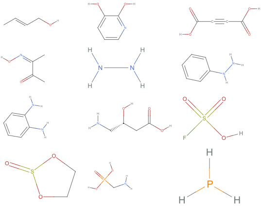

# Non Molecular Structure Language

Non-molecular structure language is a kind of [Esolang](https://en.wikipedia.org/wiki/Esoteric_programming_language), following content referred to as NMSL.

The NMSL program consists of a series of chemical expressions.

The following is a legal NMSL `"Hello world!"` program:




The reading order is from left to right, from top to bottom, its SMILES is transcribed as:

```js
C/C=C/CO
CC(=O)/C(C)=N\O
Nc1ccccc1N
O=S1OCCO1
Oc1cccnc1O
NN
NC[C@H](O)CC(=O)O
NCP(=O)(O)O
O=C(O)C#CC(=O)O
NNc1ccccc1
O=S(=O)(O)F
P
```

## Core Algorithm

If a line starts with a blank character, then this is a comment.

### Mass-Byte Conversion

The molecular weight of each particle is rounded down to obtain a big integer, and write its 256 hexadecimal representation.

- `0 => [0]`
  - `e+`
- `255 => [255]`
  - `O=c1[nH]c2ncc(Br)nc2n1C1CC1`
- `256 => [1, 0]`
  - `Cc1[nH]c2ccc(F)cc2c(=O)c1Br`
- `1926 => [7, 134]`
  - `CN[C@H](CC(C)C)C(=O)N[C@H]1C(=O)N[C@@H](CC(N)=O)C(=O)N[C@H]2C(=O)N[C@H]3C(=O)NC(C(=O)N[C@@H](C(=O)NC(=O)[C@H](Cc4ccc(O)cc4)NC(=O)[C@H](Cc4c[nH]c5ccccc45)NC(=O)[C@@H](N)CCC(=O)O)c4cc(O)cc(O)c4-c4cc3ccc4O)[C@H](O[C@H]3C[C@](C)(N)[C@@H](O)[C@H](C)O3)c3ccc(c(Cl)c3)Oc3cc2cc(c3O[C@@H]2O[C@H](CO)[C@@H](O)[C@H](O)[C@H]2O)Oc2ccc(cc2Cl)[C@H]1O`

Connect all the bytes to get a byte string.

> Note: Negative mass is regarded as 0, although no such particles are found now, but if there are any, it is regarded as zero.


### Potential Coding Bit

The potential is divided into:

- Positive charge: The sum of charges is positive
- Neutral: The sum of charges is zero
- Negative charge: the sum of charges is negative

Identify the potential of each particle. For example, if the first particle is neutral, that is the UTF8 mode, and the positive charge is the digital mode.

Negative electricity means it cannot be distinguished, read the potential of the next particle

> Note: The charge number can be a fraction, for example, the charge of the upper quark is 2/3 and the charge of the lower quark is -1/3

